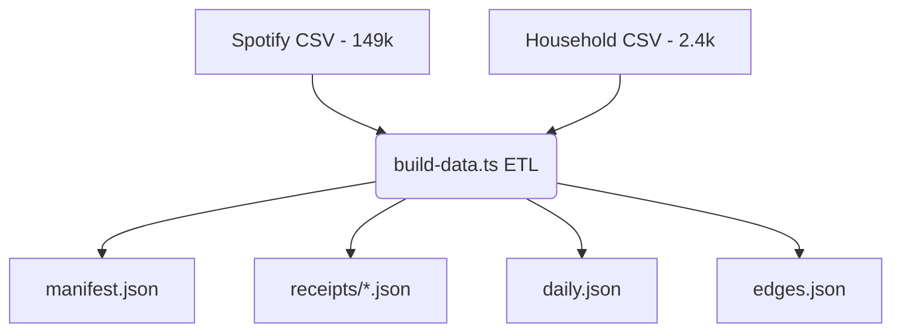

# Paper Trail — "Your Life, In Receipts"

An interactive frontend experience transforming 150,000+ digital life receipts into an archivist's case file. 
This project parses one person's Spotify history and household ledger to discover the stories hidden within 12 years of metadata.

## The Skip Storm

On September 6th, 2017, the records show 1,816 songs were played—the biggest music day in a decade. But our investigation reveals the truth: the median play time was 0.9 seconds, and 95% of the tracks were skipped. They weren't listening; they were frantically scrolling or their phone was skipping in their pocket. This insight forms the interactive entry point to our archive.

## Data Pipeline

### Sampling Methodology
To ensure high performance without sacrificing truth:
- All 2,461 household transactions are preserved (they are rare and highly valuable).
- The 149,860 Spotify plays are scored based on salience (first play, late night play, loop part, proximity to purchase).
- The top 500 tracks per year are sampled (total ~6,000 receipts shipped to browser).
- However, all aggregates (Total plays, spend, hours) use the full 152,000 dataset.

**No backend is required. No API calls are made.**

## Quick Start

1. Install dependencies: `npm install`
2. Run data pipeline: `npm run build:data`
3. Start dev server: `npm run dev`

## Deployment
Configured for automatic deployment to Vercel via the included `vercel.json`.

## Accessibility
- Keyboard navigation supported across all surfaces.
- Focus rings visible by default.
- ARIA live announcements on filter result changes.
- Fallback list view for the Force Graph.
- `prefers-reduced-motion` honored globally.
